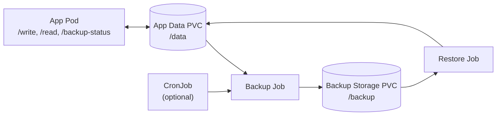
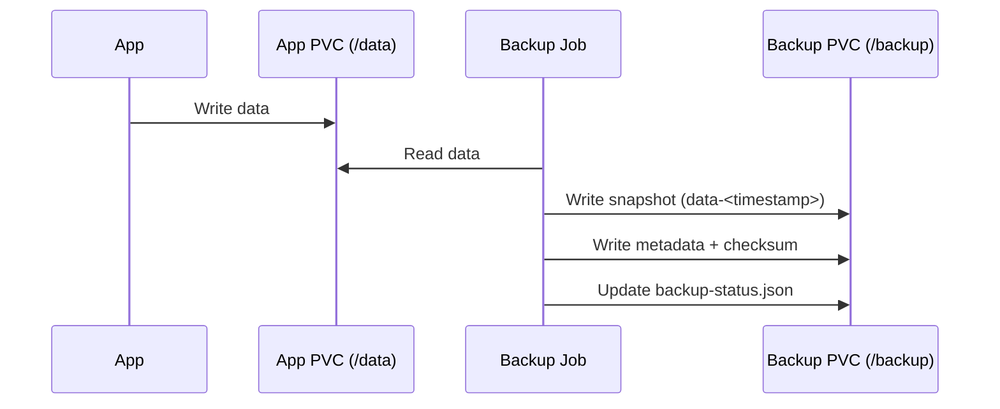
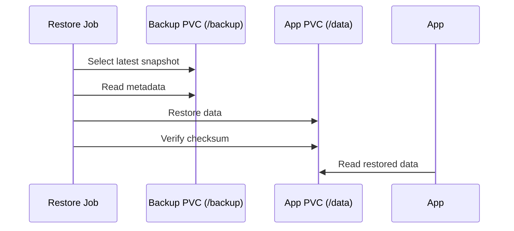

# Kubernetes Backup & Recovery Demo

## What this demo shows

- Stateful application backup and recovery workflow in Kubernetes.
- Crash-consistent and application-consistent backup modes, and how they differ in behavior during active writes.
- Versioned backups retained in backup storage.
- Metadata and checksum generation for each backup.
- Restore-time integrity verification using checksum comparison.
- Scheduled backups using a CronJob for automated backup execution.
- Failure scenarios that validate recovery and error handling behavior.

## Goal

Explore backup and recovery in Kubernetes with emphasis on **data consistency**, **failure scenarios**, and **system recovery**—what breaks, what must be preserved, and how to validate that a restore is trustworthy.

## Inspiration

Inspired by real-world challenges around data consistency, failure handling, and recovery in distributed systems.

## Problem

Distributed systems fail in layered ways: pods restart, nodes drain or die, storage misbehaves, and application state diverges from what operators assume is on disk. Backups are only useful if **restore is reliable and verifiable**.

> How do we reliably restore system state and data?

## Approach (MVP)

Initial scope:

- Run a **stateful workload** in Kubernetes with application data stored on a **PersistentVolumeClaim (PVC)**, ensuring it survives pod restarts.
- Treat this **PVC-backed storage** as the primary source of truth for application data.
- Implement a **backup workflow** using a Kubernetes Job that copies data from the application PVC to a separate backup storage PVC.
- Define an explicit **restore workflow** that restores data from backup storage, verifies integrity, and makes it available to the running application.

## Architecture (MVP Implementation)

```text
App (stateful)
    ↓
App Data PVC (PersistentVolumeClaim)
    ↓
Backup Job (Kubernetes Job)
    ↓
Backup Storage PVC (separate volume)
```

This reflects the current implemented design used in the demo.

Restore flow: a restore Job copies data from the backup storage PVC back into the application PVC, verifies it using checksum metadata, and confirms the running application can read the restored data.

## Key Questions to Explore

- What consistency model does the app assume (e.g. crash consistency vs application-quiesced)?
- When is the backup taken relative to ongoing writes, and what does that imply for restore?
- Behavior of backups **during active writes** (open files, fs cache, database semantics if applicable).
- Separation of **data vs metadata** (Kubernetes objects, PVC bindings, secrets vs bytes on disk).
- How to prove a restore succeeded (verification criteria, not just “pod is Running”).
- Failure modes to design for: node loss, partial backup, corrupt archive, wrong PVC bound to a pod.

## Future Extensions

- Incremental backups and retention policy.
- More advanced scheduling and policy-based backup strategies.
- Multi-component systems (e.g. Kafka, Postgres) and ordering/coordination of backups.
- Controlled **failure injection** to exercise restore under realistic conditions.
- Custom **controller/operator** to automate backup/restore lifecycle and status reporting.

## Status

MVP implemented — backup and restore workflow with checksum verification is functional and has been validated in a Kubernetes environment.

The demo has been validated end-to-end, including backup, failure simulation, and restore flows.

Future work will focus on deeper consistency guarantees, failure scenarios, and recovery validation.

## Backup Consistency Modes

This demo supports two backup modes:

- `crash-consistent`: copy data without coordinating with the app.
- `application-consistent`: call `POST /freeze`, run backup, then call `POST /unfreeze`.

Application-consistent mode matters during active writes because it prevents new writes while the backup copy is taken, reducing the chance of inconsistent backups.

In this demo, the manual backup Job defaults to `crash-consistent`, while `application-consistent` mode is available for comparison and validation.

## How to Run & Demo

### 1) Build and load image

```bash
docker build -t kubernetes-backup-recovery-demo-app:latest ./app
kind load docker-image kubernetes-backup-recovery-demo-app:latest
```

### 2) Deploy everything

```bash
kubectl apply -f k8s/namespace.yaml
kubectl apply -f k8s/pvc.yaml
kubectl apply -f k8s/backup-pvc.yaml
kubectl apply -f k8s/app-deployment.yaml
kubectl apply -f k8s/app-service.yaml
kubectl apply -f k8s/scripts-configmap.yaml
```

```bash
kubectl -n backup-recovery-demo get pods,pvc,svc
```

### 3) Generate data

```bash
kubectl -n backup-recovery-demo port-forward svc/backup-recovery-demo-app 8080:8080
```

In a second terminal:

```bash
curl -s -X POST http://localhost:8080/write -H 'Content-Type: application/json' -d '{"data":{"id":1,"msg":"alpha"}}'
curl -s -X POST http://localhost:8080/write -H 'Content-Type: application/json' -d '{"data":{"id":2,"msg":"beta"}}'
curl -s -X POST http://localhost:8080/write -H 'Content-Type: application/json' -d '{"data":{"id":3,"msg":"gamma"}}'
```

### 4) Verify data

```bash
curl -s http://localhost:8080/read
```

Confirm `count` is greater than `0` and `items` contains the written records.

### 5) Run backup

```bash
kubectl -n backup-recovery-demo delete job backup-data-job --ignore-not-found
kubectl apply -f k8s/backup-job.yaml
kubectl -n backup-recovery-demo wait --for=condition=complete job/backup-data-job --timeout=60s
kubectl -n backup-recovery-demo logs job/backup-data-job
```

The backup Job is currently configured to use `crash-consistent` mode. You can switch to `application-consistent` to compare behavior during active writes.

Expected log includes: `backup completed: /data/data.jsonl -> /backup/data-<timestamp>.jsonl`.

### 6) Simulate failure

Overwrite the app data file in the running pod:

```bash
POD=$(kubectl -n backup-recovery-demo get pod -l app=backup-recovery-demo-app -o jsonpath='{.items[0].metadata.name}')
kubectl -n backup-recovery-demo exec "$POD" -- sh -c ': > /data/data.jsonl'
curl -s http://localhost:8080/read
```

Confirm `count` is `0`.

### 7) Run restore

```bash
kubectl -n backup-recovery-demo delete job restore-data-job --ignore-not-found
kubectl apply -f k8s/restore-job.yaml
kubectl -n backup-recovery-demo wait --for=condition=complete job/restore-data-job --timeout=60s
kubectl -n backup-recovery-demo logs job/restore-data-job
```

### 8) Verify recovery

```bash
curl -s http://localhost:8080/read
```

Confirm the previous records are back.

### 9) Observability hints

```bash
kubectl -n backup-recovery-demo get pods
kubectl -n backup-recovery-demo logs deploy/backup-recovery-demo-app
kubectl -n backup-recovery-demo describe job backup-data-job
kubectl -n backup-recovery-demo describe job restore-data-job
curl -s http://localhost:8080/backup-status
```

`/backup-status` returns the latest known backup result (mode, backup file, checksum, and success/failure message), or `status: unknown` if no backup has run yet.

### Backup Status Endpoint

The application exposes a `/backup-status` endpoint that returns information about the latest backup:

- status (`success`/`failure`/`unknown`)
- mode (`crash-consistent`/`application-consistent`)
- backup file name
- checksum
- timestamp

This demonstrates how a system can expose backup observability and operational state to external systems.

## Scheduled Backups

This demo also includes a Kubernetes CronJob for periodic backups in `k8s/backup-cronjob.yaml`.

The CronJob runs every 2 minutes for demo purposes, uses `crash-consistent` mode by default to avoid interfering with application writes, and reuses the same backup script.

This is useful as a simple foundation for automated backup strategies without changing the core backup/restore workflow.

## Backup Versioning

Backups are stored as versioned backup files (for example `data-2026-04-10T18-30-00Z.jsonl`) with matching versioned metadata files (`metadata-2026-04-10T18-30-00Z.json`), so multiple backups are retained.

Restore automatically selects the latest backup and verifies it using the checksum from the matching metadata file.

Backups are not automatically pruned in this demo. Real systems require retention policies, for example keeping the last N backups or using time-based retention windows.

## Failure Scenarios to Test

### A) Data loss

This simulates application-level data loss while persistent backup files still exist.

```bash
POD=$(kubectl -n backup-recovery-demo get pod -l app=backup-recovery-demo-app -o jsonpath='{.items[0].metadata.name}')
kubectl -n backup-recovery-demo exec "$POD" -- sh -c ': > /data/data.jsonl'
curl -s http://localhost:8080/read
kubectl -n backup-recovery-demo delete job restore-data-job --ignore-not-found
kubectl apply -f k8s/restore-job.yaml
kubectl -n backup-recovery-demo wait --for=condition=complete job/restore-data-job --timeout=60s
curl -s http://localhost:8080/read
```

Expected outcome: read output is empty after truncation, then previous data returns after restore.

### B) Pod restart

This simulates runtime pod failure while PVC-backed data remains intact.

```bash
kubectl -n backup-recovery-demo delete pod -l app=backup-recovery-demo-app
kubectl -n backup-recovery-demo wait --for=condition=Ready pod -l app=backup-recovery-demo-app --timeout=120s
curl -s http://localhost:8080/read
```

Expected outcome: a new pod is created and data is still present because it is stored on the PVC.

### C) Backup corruption

This simulates tampered backup content to validate checksum-based integrity detection.

```bash
POD=$(kubectl -n backup-recovery-demo get pod -l app=backup-recovery-demo-app -o jsonpath='{.items[0].metadata.name}')
LATEST_BACKUP=$(kubectl -n backup-recovery-demo exec "$POD" -- sh -c "ls -1 /backup/data-*.jsonl 2>/dev/null | sort -r | head -n 1")
kubectl -n backup-recovery-demo exec "$POD" -- sh -c "echo 'corruption' >> \"$LATEST_BACKUP\""
kubectl -n backup-recovery-demo delete job restore-data-job --ignore-not-found
kubectl apply -f k8s/restore-job.yaml
kubectl -n backup-recovery-demo wait --for=condition=failed job/restore-data-job --timeout=60s
kubectl -n backup-recovery-demo logs job/restore-data-job
```

Expected outcome: restore fails and logs show checksum mismatch.

### D) Missing backup

This simulates a restore attempt when backup artifacts are missing.

```bash
POD=$(kubectl -n backup-recovery-demo get pod -l app=backup-recovery-demo-app -o jsonpath='{.items[0].metadata.name}')
kubectl -n backup-recovery-demo exec "$POD" -- sh -c 'rm -f /backup/data-*.jsonl /backup/metadata-*.json'
kubectl -n backup-recovery-demo delete job restore-data-job --ignore-not-found
kubectl apply -f k8s/restore-job.yaml
kubectl -n backup-recovery-demo wait --for=condition=failed job/restore-data-job --timeout=60s
kubectl -n backup-recovery-demo logs job/restore-data-job
```

Expected outcome: restore fails because no backup files are available.

## Visual Workflow Overview

### High-Level Architecture



This diagram separates:
- Data plane: application state stored in PVCs
- Control plane: Jobs and CronJob orchestrating backup and restore workflows

---

### Backup Flow



---

### Restore Flow



---

## What these scenarios demonstrate

- Backups are only useful when restore is validated end-to-end.
- Checksum verification is required to detect silent corruption.
- PVC-backed data survives pod restarts, but not application-level data loss.
- Restore workflows must fail clearly on missing or invalid backup artifacts.
- Operational confidence comes from regularly exercising failure and recovery paths.

## Limitations

- This is a simplified demo focused on core backup and recovery concepts.
- Storage assumptions are single-cluster and demo-oriented, not production-hardened.
- There is no distributed coordination across multiple services or components.
- Operational concerns like advanced retention, security hardening, and DR orchestration are intentionally out of scope.
