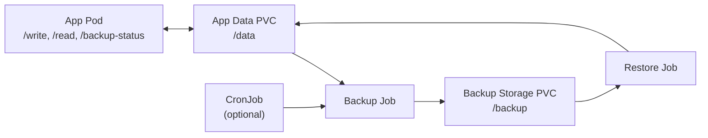
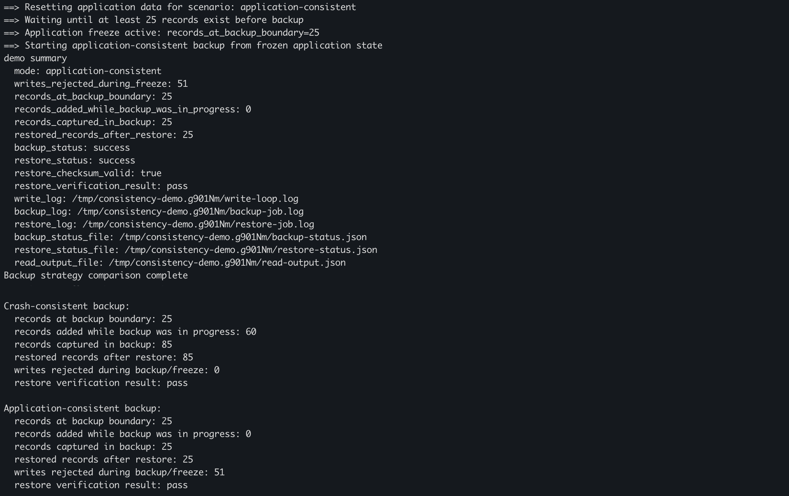

# Kubernetes Backup & Recovery Demo

[](https://github.com/samuelhajnik/kubernetes-backup-recovery-demo/actions/workflows/ci.yml)

This repository demonstrates a core reliability principle for stateful Kubernetes systems:

> Backup success does not guarantee recovery success.

The demo compares crash-consistent and application-consistent backups under active writes. It shows how backup strategy affects availability, consistency, and confidence in recovery.

The goal is not only to run a Kubernetes backup Job. The goal is to make backup correctness observable through repeatable scenarios, restore verification, and failure-aware design.

---

## What This Repo Demonstrates

This project compares two backup strategies for a stateful Kubernetes workload:


| Backup Strategy               | Behavior                                                  | Main Trade-off                                                      |
| ----------------------------- | --------------------------------------------------------- | ------------------------------------------------------------------- |
| Crash-consistent backup       | Copies state while the application keeps accepting writes | Preserves availability, but may capture in-flight state             |
| Application-consistent backup | Coordinates with the application before copying state     | Produces a cleaner restore point, but may temporarily reject writes |


The main lesson is that backup success is not the same as recovery success.

A backup file may exist, a Kubernetes Job may complete, and the restored pod may start successfully — but the system still needs to prove that the restored state is correct.

---

## Why This Matters

Backup and recovery are often treated as infrastructure tasks:

> Schedule a backup Job, copy files, store the artifact, restore when needed.

That is not enough for stateful systems.

Stateful applications may have in-flight writes, cached state, pending background work, or multiple pieces of data that need to stay consistent with each other. If a backup captures state at the wrong moment, the restored system may start but contain incorrect or incomplete data.

This demo makes that problem visible by comparing backup behavior while writes are actively happening.

---

## High-Level Architecture



The data plane is the PVC-backed application and backup state. The control plane is made of Kubernetes backup and restore Jobs, with optional CronJob scheduling.

---

## Quick Start

```bash
./scripts/run-backup-recovery-demo.sh --compare
```

This is the recommended local reviewer workflow. It:

- creates or reuses a local kind cluster
- builds and loads the demo app image
- runs crash-consistent and application-consistent scenarios
- generates writes during backup
- restores from backup
- verifies restored data through the application API
- prints a comparison summary in one place

Optional commands:

```bash
./scripts/run-backup-recovery-demo.sh --crash-consistent
./scripts/run-backup-recovery-demo.sh --application-consistent
```

Useful environment variables:

```bash
KEEP_CLUSTER=true ./scripts/run-backup-recovery-demo.sh --compare
BACKUP_START_MIN_RECORDS=50 ./scripts/run-backup-recovery-demo.sh --compare
```

---

## What You Should Observe

### Crash-consistent backup

In crash-consistent mode, writes are not frozen while backup is running.

You should observe:

- `writes rejected during backup/freeze` should be `0`
- `records added while backup was in progress` should usually be greater than `0`
- `restored records after restore` should match `records captured in backup`

This approach preserves availability because the application does not stop accepting writes. The trade-off is that the backup may capture in-flight or partially coordinated state.

---

### Application-consistent backup

In application-consistent mode, the application is frozen before the backup copy boundary.

You should observe:

- accepted writes stop at the backup boundary during the freeze period
- some writes are rejected during backup/freeze
- `records added while backup was in progress` should be `0`
- `records captured in backup` should match `records at backup boundary`
- `restored records after restore` should match `records captured in backup`

This approach improves confidence in restore correctness. The trade-off is that write availability is temporarily reduced while the application is frozen.

---

## Automated Backup Strategy Comparison

The automated local reviewer workflow is:

```bash
./scripts/run-backup-recovery-demo.sh --compare
```

The script warms up the app, runs a backup while writes are active, restores the backup, verifies restored data through the application API, and prints the comparison summary.

The human-readable comparison focuses on backup and restore proof:

- `records at backup boundary`
- `records added while backup was in progress`
- `records captured in backup`
- `restored records after restore`
- `writes rejected during backup/freeze`
- `restore verification result`

### Example output

A successful `--compare` run prints the comparison summary below:



### What the comparison shows

**Crash-consistent (signals in the output)**

- Writes are not frozen.
- Writes are not rejected.
- Records can be added while the backup copy is in progress.
- Restored records match the backup snapshot.

**Application-consistent (signals in the output)**

- The app freezes before the backup copy.
- Some writes are rejected during the freeze window.
- Records added while backup is in progress should be `0`.
- Records captured in backup should match the frozen backup boundary.
- Restored records match the backup snapshot.

The key difference is visible in the comparison output:

- In the crash-consistent scenario, the backup starts with a fixed backup-boundary record count, but additional records can be added while the backup copy is in progress. No writes are rejected.
- In the application-consistent scenario, the backup starts from the frozen backup-boundary state. No records are added during the backup copy, and rejected writes show the temporary availability trade-off.
- In both scenarios, `restored records after restore` matches `records captured in backup`, so the script verifies recovery through the application instead of only checking that Kubernetes Jobs completed.

## Key Trade-offs and Lessons

### 1. Crash-consistent backups preserve availability

Crash-consistent backups allow the application to keep accepting writes while the backup is being taken.

This minimizes user-visible disruption. The trade-off is that the backup may capture state while writes are still in progress.

Crash-consistent backups can be acceptable when the application or storage layer can recover safely from that state, for example through journaling, transaction logs, checkpoints, or replay mechanisms.

---

### 2. Application-consistent backups improve restore confidence

Application-consistent backups coordinate with the application before copying state.

In this demo, the application briefly enters a freeze window and rejects writes with HTTP `409` while the backup is in progress.

The benefit is a cleaner restore point. The trade-off is availability: some writes are temporarily rejected, and clients must be able to retry or handle that response correctly.

---

### 3. Restore verification matters more than backup completion

A completed backup file does not prove that recovery works.

A backup Job can succeed even if the restored data would later be incomplete, stale, or inconsistent. For this reason, restore testing is more important than simply checking that backup artifacts exist.

This demo uses metadata and checksum verification to make restore correctness visible.

> Backup completion proves that data was copied. Restore verification proves that the copied data can be used.

---

### 4. Kubernetes Jobs run the workflow, but do not define correctness

Kubernetes Jobs are useful for running backup and restore workflows, but they do not define the correctness model.

A Job can copy files, retry execution, and report completion. It cannot decide whether the copied state is application-consistent or whether restored data satisfies business expectations.

The application and system design still need to define consistency, verification, and recovery rules.

---

## How This Maps to Real Systems

The same trade-offs appear in production systems such as:

- databases using snapshots, WAL, checkpoints, and restore validation
- stateful Kubernetes workloads using PVC snapshots
- queues and event-processing systems with in-flight messages
- payment or order-processing systems with durable state
- backup control planes and disaster-recovery workflows

The exact technology may differ, but the design questions are similar:

- Can writes continue while the backup is taken?
- What consistency level does the restored system require?
- What happens to in-flight writes?
- Can clients safely retry rejected writes?
- How is restore correctness verified?
- Is a running pod enough, or does restored data need deeper validation?

---

## Production Considerations

A production version of this design would usually require:

- clear recovery point objective and recovery time objective
- documented consistency model for backups
- regular restore testing, not only backup scheduling
- checksum, metadata, or application-level validation
- client retry behavior for coordinated freeze windows
- monitoring and alerting for backup and restore failures
- backup retention and lifecycle management
- encryption and access control for backup artifacts
- cross-zone or cross-region recovery strategy
- disaster-recovery runbooks

Backup strategy should be tested as part of system reliability, not treated as a background maintenance task.

---

## Repository Guide

- [Architecture](docs/architecture.md)
- [Consistency Model](docs/consistency.md)
- [Failure Scenarios](docs/failure-scenarios.md)
- [Demo Guide](docs/demo-guide.md)
- [Observability and Status Endpoint](docs/observability.md)

---

## Current Scope

This repository intentionally keeps the implementation focused:

- single stateful application
- PVC-backed live data and backup storage
- file-copy backup model with versioned backup files
- checksum verification during restore
- local Kubernetes validation using `kind`

The simplified scope makes the consistency trade-off easier to observe.

---

## Limitations

This is not a production-ready disaster-recovery platform.

Current limitations:

- simplified demo focused on core backup/recovery concepts
- single-cluster storage assumptions
- no distributed coordination across multiple services or components
- no production-grade retention, encryption, access control, or cross-region recovery
- file-copy backup model rather than database-native snapshot or replication tooling

These limitations are intentional. The purpose of the repo is to make backup and restore trade-offs visible in a small, repeatable demo.

---

## CI

GitHub Actions runs on pushes and pull requests to `main`.

CI validates:

- Go unit tests (`go test ./...`), including `/backup-status` behavior, freeze/unfreeze write rejection, and corrupted JSONL handling
- no-cluster restore scenario tests (`scripts/test-restore-scenarios.sh`)
- script linting (`bash -n`, ShellCheck on shell scripts under `scripts/` and `jobs/`)
- Kubernetes manifest validation (yamllint, kubeconform)

The no-cluster restore scenario test (`scripts/test-restore-scenarios.sh`) validates restore-job behavior for valid backups, checksum mismatch, missing backup files, and missing metadata. It invokes `jobs/restore.sh` against temporary directories and does not require a Kubernetes cluster.

The full Kubernetes backup/restore scenario remains a documented local demo because it requires persistent-volume behavior in a real cluster; run `./scripts/run-backup-recovery-demo.sh --compare` against kind for end-to-end verification.

## Summary

This demo highlights a core reliability principle for stateful systems:

> Backup success does not guarantee recovery success.

Crash-consistent backups can preserve availability and keep writes flowing, but they may capture in-flight or partially coordinated state. Application-consistent backups introduce coordination and may temporarily reject writes, but they produce a cleaner restore point.

The important lesson is that backup strategy is part of system design, not just infrastructure operations. A reliable backup approach must define the required consistency level, the acceptable availability impact, and how recovery confidence will be proven.

Checksums, metadata, and restore validation turn backups from stored copies into tested recovery points. Without verification, a backup may exist, but the system still does not know whether it can safely recover from it.