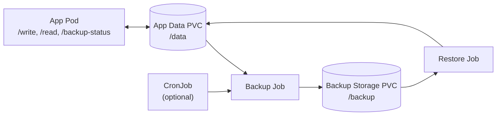
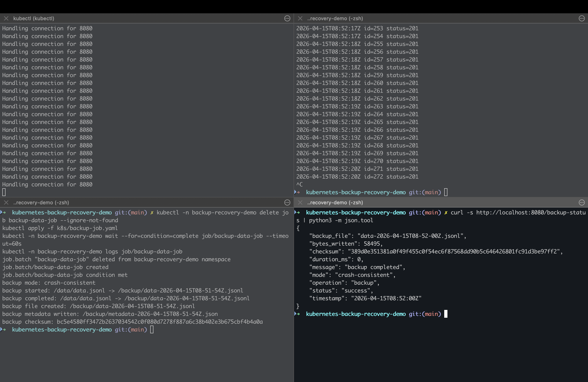
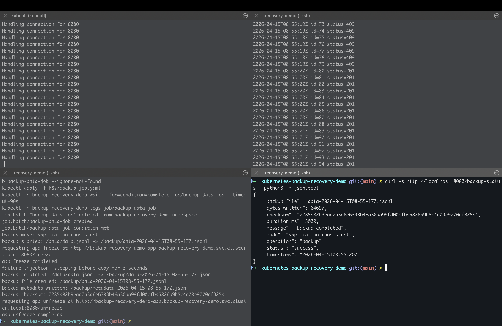
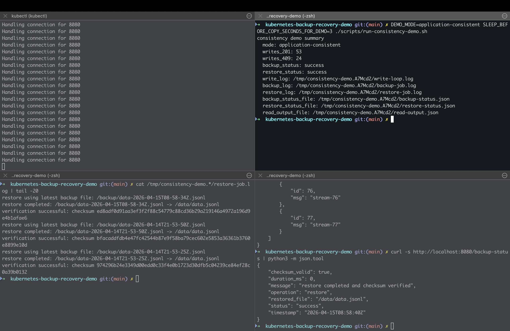

# Kubernetes Backup & Recovery Demo

Hands-on Kubernetes demo that exposes a subtle but critical distributed systems problem: the difference between crash-consistent and application-consistent backups under active writes.

It includes failure injection, checksum-based restore verification, and repeatable consistency comparison scenarios.

## Why this demo is interesting

- Demonstrates the real-world impact of crash-consistent vs application-consistent backups
- Shows how uncoordinated backups can capture in-flight state under active writes
- Uses checksum validation to prove restore correctness, not just “pod is running”
- Includes failure injection to test backup and restore behavior under faults
- Makes consistency observable through HTTP `409` responses during coordinated backups

## Demo flow (3 steps)

1. Generate writes
2. Trigger backup
3. Restore and verify

## High-Level Architecture



Data plane is PVC-backed application and backup state; control plane is backup/restore Jobs plus optional CronJob scheduling.

## Quick Start

```bash
docker build -t kubernetes-backup-recovery-demo-app:latest ./app
kind load docker-image kubernetes-backup-recovery-demo-app:latest
kubectl apply -f k8s/namespace.yaml
kubectl apply -f k8s/pvc.yaml
kubectl apply -f k8s/backup-pvc.yaml
kubectl apply -f k8s/app-deployment.yaml
kubectl apply -f k8s/app-service.yaml
kubectl apply -f k8s/scripts-configmap.yaml
kubectl -n backup-recovery-demo port-forward svc/backup-recovery-demo-app 8080:8080
DEMO_MODE=application-consistent SLEEP_BEFORE_COPY_SECONDS_FOR_DEMO=3 ./scripts/run-consistency-demo.sh
```

## What you will observe

### Crash-consistent

- Writes continue with no application-level coordination.
- Backups reflect a best-effort point in time under active write pressure.

### Application-consistent

- Backup briefly coordinates with the app via freeze/unfreeze.
- Some writes may return HTTP `409` during the freeze window.

## Visual Comparison

### Crash-consistent (no coordination)

- Writes continue during backup.
- Backup is taken without pausing application writes.
- Resulting backup point can include in-flight state.



### Application-consistent (with coordination)

- Backup coordinates with the application using a short freeze window.
- Some write attempts are rejected with HTTP `409` while frozen.
- Backup is captured from a cleaner, coordinated restore point.



### Observability and outcome

- Backup/restore status, write outcomes, and verification signals are visible in one flow.
- Summary output includes write response counts and restore verification context.



## Real-world relevance

This demo reflects problems that appear in real systems:

- Databases (snapshots, WAL, checkpointing)
- Distributed systems (stateful services, queues, and background workers)
- Backup tooling and control planes that must choose between crash-consistent and application-consistent behavior

Understanding this trade-off matters when restore correctness is more important than simply taking a backup.

## Key Insight

Backups are easy to run, but correctness is defined by restore.

This demo shows that:
- crash-consistent backups preserve availability but may capture inconsistent state
- application-consistent backups trade availability for a reliable restore point
- verification (checksums, restore tests) is essential

## Repository Guide

- [Architecture](docs/architecture.md)
- [Consistency Model](docs/consistency.md)
- [Failure Scenarios](docs/failure-scenarios.md)
- [Demo Guide](docs/demo-guide.md)
- [Observability and Status Endpoint](docs/observability.md)

## Current Scope

- Single stateful application
- PVC-backed live data and backup storage
- File-copy backup model with versioned backup files
- Checksum verification during restore
- Validated in local Kubernetes (kind)

## Limitations

- Simplified demo focused on core backup/recovery concepts.
- Single-cluster storage assumptions; not production-hardened DR.
- No distributed coordination across multiple services/components.
