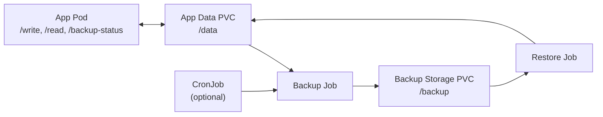

# Kubernetes Backup & Recovery Demo

[](https://github.com/samuelhajnik/kubernetes-backup-recovery-demo/actions/workflows/ci.yml)

This repository demonstrates a core reliability principle for stateful Kubernetes systems:

> Backup success does not guarantee recovery success.

The demo compares crash-consistent and application-consistent backups under active writes. It shows how backup strategy affects availability, consistency, and confidence in recovery.

The goal is not only to run a Kubernetes backup Job. The goal is to make backup correctness observable through repeatable scenarios, restore verification, and failure-aware design.

---

## What This Repo Demonstrates

This project compares two backup strategies for a stateful Kubernetes workload:

| Backup Strategy | Behavior | Main Trade-off |
|-----------------|----------|----------------|
| Crash-consistent backup | Copies state while the application keeps accepting writes | Preserves availability, but may capture in-flight state |
| Application-consistent backup | Coordinates with the application before copying state | Produces a cleaner restore point, but may temporarily reject writes |

The main lesson is that backup success is not the same as recovery success.

A backup file may exist, a Kubernetes Job may complete, and the restored pod may start successfully — but the system still needs to prove that the restored state is correct.

---

## Why This Matters

Backup and recovery are often treated as infrastructure tasks:

> Schedule a backup Job, copy files, store the artifact, restore when needed.

That is not enough for stateful systems.

Stateful applications may have in-flight writes, cached state, pending background work, or multiple pieces of data that need to stay consistent with each other. If a backup captures state at the wrong moment, the restored system may start but contain incorrect or incomplete data.

This demo makes that problem visible by comparing backup behavior while writes are actively happening.

---

## Demo Flow

The demo follows a simple three-step flow:

1. Generate writes against the application.
2. Trigger a backup while writes are active.
3. Restore the backup and verify the restored state.

The same flow is used to compare crash-consistent and application-consistent behavior.

---

## High-Level Architecture



The data plane is the PVC-backed application and backup state. The control plane is made of Kubernetes backup and restore Jobs, with optional CronJob scheduling.

---

## Quick Start

```bash
docker build -t kubernetes-backup-recovery-demo-app:latest ./app
kind load docker-image kubernetes-backup-recovery-demo-app:latest

kubectl apply -f k8s/namespace.yaml
kubectl apply -f k8s/pvc.yaml
kubectl apply -f k8s/backup-pvc.yaml
kubectl apply -f k8s/app-deployment.yaml
kubectl apply -f k8s/app-service.yaml
kubectl apply -f k8s/scripts-configmap.yaml

kubectl -n backup-recovery-demo port-forward svc/backup-recovery-demo-app 8080:8080
```

Run the application-consistent demo:

```bash
DEMO_MODE=application-consistent SLEEP_BEFORE_COPY_SECONDS_FOR_DEMO=3 ./scripts/run-consistency-demo.sh
```

Run the crash-consistent demo:

```bash
DEMO_MODE=crash-consistent SLEEP_BEFORE_COPY_SECONDS_FOR_DEMO=3 ./scripts/run-consistency-demo.sh
```

---

## What You Should Observe

### Crash-consistent backup

In crash-consistent mode, writes continue while the backup is being taken.

You should observe:

- writes continue without application-level coordination
- the backup is taken while the system is under active write pressure
- no HTTP `409` responses are expected from freeze logic

This approach preserves availability because the application does not stop accepting writes. The trade-off is that the backup may capture in-flight or partially coordinated state.

---

### Application-consistent backup

In application-consistent mode, the backup process briefly coordinates with the application before copying state.

You should observe:

- the application enters a short freeze window
- some write attempts may return HTTP `409`
- the backup is captured from a cleaner restore point
- the system unfreezes after the backup operation finishes

This approach improves confidence in restore correctness. The trade-off is that write availability is temporarily reduced while the application is frozen.

---

## Visual Comparison

### Crash-consistent run

Writes continue during backup. The backup is taken without pausing application writes.


---

### Application-consistent run

The backup coordinates with the application using a short freeze window. Some write attempts are rejected with HTTP `409` while frozen.


---

### Observability and outcome

Backup and restore status, write outcomes, and verification signals are visible in one flow.


---

## Key Trade-offs and Lessons

### 1. Crash-consistent backups preserve availability

Crash-consistent backups allow the application to keep accepting writes while the backup is being taken.

This minimizes user-visible disruption. The trade-off is that the backup may capture state while writes are still in progress.

Crash-consistent backups can be acceptable when the application or storage layer can recover safely from that state, for example through journaling, transaction logs, checkpoints, or replay mechanisms.

---

### 2. Application-consistent backups improve restore confidence

Application-consistent backups coordinate with the application before copying state.

In this demo, the application briefly enters a freeze window and rejects writes with HTTP `409` while the backup is in progress.

The benefit is a cleaner restore point. The trade-off is availability: some writes are temporarily rejected, and clients must be able to retry or handle that response correctly.

---

### 3. Restore verification matters more than backup completion

A completed backup file does not prove that recovery works.

A backup Job can succeed even if the restored data would later be incomplete, stale, or inconsistent. For this reason, restore testing is more important than simply checking that backup artifacts exist.

This demo uses metadata and checksum verification to make restore correctness visible.

> Backup completion proves that data was copied. Restore verification proves that the copied data can be used.

---

### 4. Kubernetes Jobs run the workflow, but do not define correctness

Kubernetes Jobs are useful for running backup and restore workflows, but they do not define the correctness model.

A Job can copy files, retry execution, and report completion. It cannot decide whether the copied state is application-consistent or whether restored data satisfies business expectations.

The application and system design still need to define consistency, verification, and recovery rules.

---

## How This Maps to Real Systems

The same trade-offs appear in production systems such as:

- databases using snapshots, WAL, checkpoints, and restore validation
- stateful Kubernetes workloads using PVC snapshots
- queues and event-processing systems with in-flight messages
- payment or order-processing systems with durable state
- backup control planes and disaster-recovery workflows

The exact technology may differ, but the design questions are similar:

- Can writes continue while the backup is taken?
- What consistency level does the restored system require?
- What happens to in-flight writes?
- Can clients safely retry rejected writes?
- How is restore correctness verified?
- Is a running pod enough, or does restored data need deeper validation?

---

## Production Considerations

A production version of this design would usually require:

- clear recovery point objective and recovery time objective
- documented consistency model for backups
- regular restore testing, not only backup scheduling
- checksum, metadata, or application-level validation
- client retry behavior for coordinated freeze windows
- monitoring and alerting for backup and restore failures
- backup retention and lifecycle management
- encryption and access control for backup artifacts
- cross-zone or cross-region recovery strategy
- disaster-recovery runbooks

Backup strategy should be tested as part of system reliability, not treated as a background maintenance task.

---

## Repository Guide

- [Architecture](docs/architecture.md)
- [Consistency Model](docs/consistency.md)
- [Failure Scenarios](docs/failure-scenarios.md)
- [Demo Guide](docs/demo-guide.md)
- [Observability and Status Endpoint](docs/observability.md)

---

## Current Scope

This repository intentionally keeps the implementation focused:

- single stateful application
- PVC-backed live data and backup storage
- file-copy backup model with versioned backup files
- checksum verification during restore
- local Kubernetes validation using `kind`

The simplified scope makes the consistency trade-off easier to observe.

---

## Limitations

This is not a production-ready disaster-recovery platform.

Current limitations:

- simplified demo focused on core backup/recovery concepts
- single-cluster storage assumptions
- no distributed coordination across multiple services or components
- no production-grade retention, encryption, access control, or cross-region recovery
- file-copy backup model rather than database-native snapshot or replication tooling

These limitations are intentional. The purpose of the repo is to make backup and restore trade-offs visible in a small, repeatable demo.

---

## CI

GitHub Actions runs on pushes and pull requests to `main`. The workflow verifies the Go code with `go test` and `go vet`, lints the Kubernetes YAML manifests, and validates them against Kubernetes schemas.

## Summary

This demo highlights a core reliability principle for stateful systems:

> Backup success does not guarantee recovery success.

Crash-consistent backups can preserve availability and keep writes flowing, but they may capture in-flight or partially coordinated state. Application-consistent backups introduce coordination and may temporarily reject writes, but they produce a cleaner restore point.

The important lesson is that backup strategy is part of system design, not just infrastructure operations. A reliable backup approach must define the required consistency level, the acceptable availability impact, and how recovery confidence will be proven.

Checksums, metadata, and restore validation turn backups from stored copies into tested recovery points. Without verification, a backup may exist, but the system still does not know whether it can safely recover from it.
