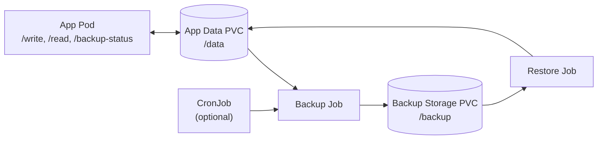
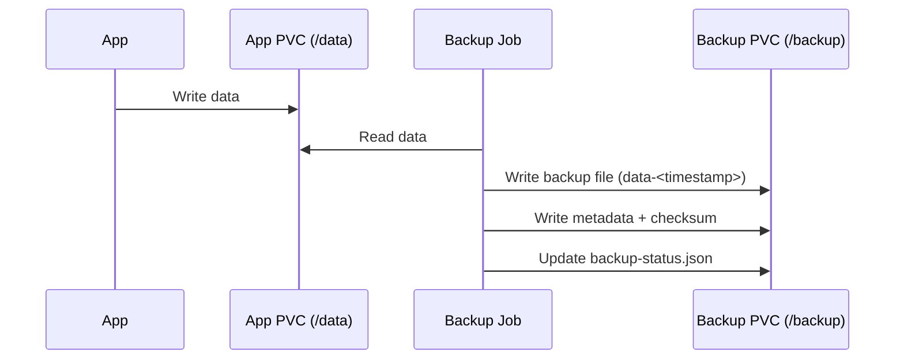
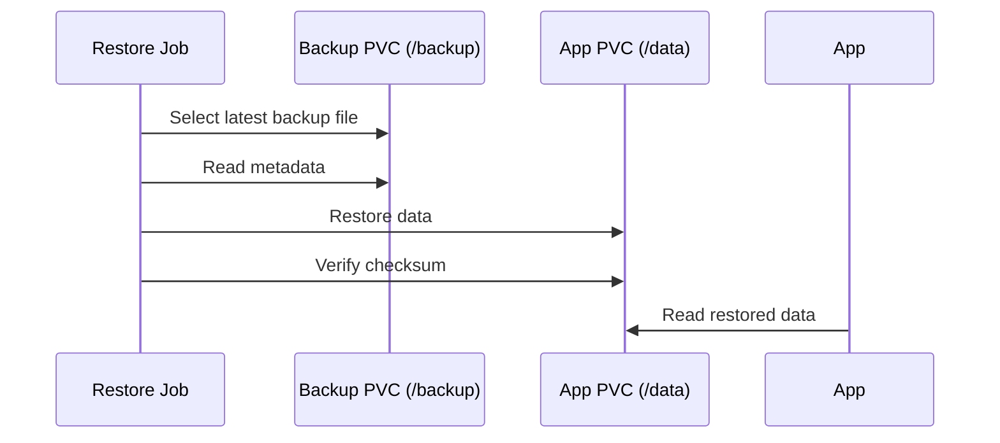

# Architecture

## Current Implemented Design

This architecture intentionally separates data movement (Jobs) from data ownership (PVCs), making backup and restore behavior explicit, observable, and testable.

The demo runs a stateful application backed by a PVC. Kubernetes Jobs are used to copy data to a separate backup PVC and restore it when needed.

```text
App (stateful)
    ↓
App Data PVC (PersistentVolumeClaim)
    ↓
Backup Job (Kubernetes Job)
    ↓
Backup Storage PVC (separate volume)
```

This design enforces a key property: the application never directly controls backups. All backup and restore operations are externalized via Kubernetes Jobs, which makes failures, retries, and consistency behavior explicit and testable.

Restore flow: a restore Job copies data from the backup storage PVC back into the application PVC, verifies it using checksum metadata, and confirms the running application can read the restored data.

This makes restore correctness observable and verifiable, rather than assumed based on application state.

## Data Plane vs Control Plane

The system is intentionally split into a data plane and a control plane to isolate state from orchestration logic.

- Data plane:
  - `app-data-pvc` stores live application data under `/data`
  - `backup-storage-pvc` stores versioned backup files, metadata, and operation status under `/backup`
- Control plane:
  - Backup Job and Restore Job move/verify data
  - Optional CronJob schedules recurring backups

This separation mirrors real-world systems where data durability and operational workflows must evolve independently.

## Design Questions to Explore

- What consistency model does the app assume (e.g. crash consistency vs application-quiesced)?
- When is the backup taken relative to ongoing writes, and what does that imply for restore?
- Behavior of backups during active writes (open files, fs cache, application semantics).
- Separation of data vs metadata (Kubernetes objects, PVC bindings, secrets vs bytes on disk).
- How to prove a restore succeeded (verification criteria, not just “pod is Running”).
- Failure modes to design for: node loss, partial backup, corrupt archive, wrong PVC bound to a pod.

A fundamental trade-off emerges: strict consistency requires coordination (and may block writes), while higher availability allows uncoordinated snapshots at the cost of potential inconsistency.

## Why not volume snapshots?

In real Kubernetes environments, storage-level snapshots are often used instead of file-copy backups.

This demo intentionally avoids them to make consistency behavior visible:

- File-copy backups expose timing issues during active writes
- Application coordination (`freeze`/`unfreeze`) becomes explicit
- Failure scenarios can be injected and observed deterministically

In contrast, storage snapshots move these concerns into the storage layer, making them harder to reason about without deeper infrastructure knowledge.

## Future Extensions

- Incremental backups and retention policy.
- More advanced scheduling and policy-based backup strategies.
- Multi-component systems (e.g. Kafka, Postgres) and ordering/coordination of backups.
- Controlled failure injection to exercise restore under realistic conditions.
- Custom controller/operator to automate backup/restore lifecycle and status reporting.

## Execution Flow

### High-Level Architecture



### Backup Flow



### Restore Flow



---

## Key Takeaway

Reliable backups are not just about copying data — they are about defining and validating a consistent point in time that can be restored with confidence.
